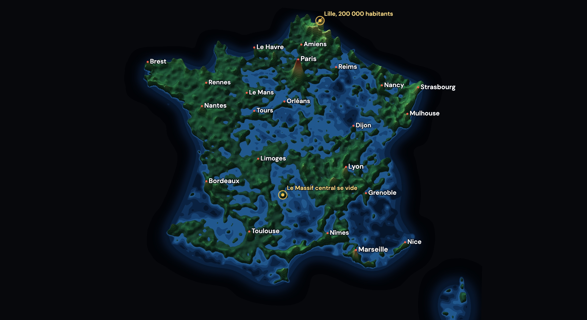

<a href="https://www.linkedin.com/in/jeremy-magrin/">
  
</a>

[](README.md)
[](README.fr.md)

# Reliefs — France, drawn by its people

[](LICENSE)
[](#licences)
[](#licences)
[](https://france-population-relief.pages.dev)
[](https://github.com/magrinj/france-population-relief/actions/workflows/deploy.yml)

Every one of the **34,746 communes** of metropolitan France, Corsica included, sized by the people living in it, from the **first census of 1793** to **2023**. A relief map: height and colour are how densely each commune is settled, on one fixed scale for the whole period, so the country visibly fills up. In 1793 almost everything is under water and the towns are islands; by 2023 the plains have risen, the emptied countryside has sunk back, and Paris is in the snow.

Everything comes from public census counts, nothing from a model. The idea and the look follow [Germany, drawn by its people](https://chillchamp1.github.io/lab/bevoelkerung-kreise/) by chillchamp1, adapted to France at commune level and extended back to the Revolution.

<video src="https://github.com/user-attachments/assets/placeholder" width="100%"></video>

## What the map shows

Figures from the bundled data (`npm test` checks them).

| | |
|---|---|
| Communes | **34,746** (2025 boundaries, Paris as one commune, no overseas) |
| Censuses | **51**, from Year II (1793) to 2023; annual since 2006 |
| 1793 | 28.2 M counted in 33,097 communes; Paris 656,000 |
| 1876 | 38.4 M; Alsace-Moselle counted by the German censuses until 1911 |
| 1911 | 41.4 M, Paris at its peak (2.89 M) |
| 1921 | 39.2 M, fewer than in 1911 |
| 2023 | 66.2 M in metropolitan France |
| Cassini vs INSEE, 1999 | 34,534 of 34,688 communes identical, total difference 0.04 % |

Hover the map for the département under the cursor: its outline, population at the current year, density, share of the country, growth since 1793 and its whole series, plus the commune itself. Click a département to zoom on it (click again, or on the sea, to come back), scroll to zoom under the cursor, `+`, `−` and Escape on the keyboard. Play at 1×, 2× or 4×, tilt and turn the relief (or drag it), toggle the city names, switch between French and English (the browser language by default, `?lang=en` or `?lang=fr` to force it). The historical periods appear on the left as the years pass, and each one pulses for a few seconds where it happened: Roubaix and its mills, Verdun, the flattened Le Havre, Sarcelles, Longwy.

## Run

```sh
npm install
npm run dev
```

Open http://localhost:5173. `npm run build` writes a static site to `dist/` (no server, no API key), `npm run preview` serves it, `npm test` checks the calculations, the bundled data and, if Chrome is installed, the rendering itself.

## Data and method

`public/data/` holds three files built by `npm run data` (about 4 MB, cached sources in `.cache/`):

- `meta.json`: the communes (code, name, département, area in km², label point), the départements and the census years.
- `pop.bin`: the population of every commune at every census, as delta varints; a missing count is kept as missing.
- `grid.bin`: a 1 km grid in Lambert-93 (1224 × 1145 cells), each cell holding the commune it belongs to, run-length encoded.

Sources:

- **INSEE, Séries historiques de population 1876-2023** ([statistiques/3698339](https://www.insee.fr/fr/statistiques/3698339)): 37 censuses per commune, already in the 1 January 2025 geography. Corsica is missing before 1936 and there is no 1946 count.
- **EHESS / LaDéHiS, *Des villages de Cassini aux communes d'aujourd'hui*** ([Didómena](https://didomena.ehess.fr/concern/data_sets/6395wb092)): 33 censuses from Year II to 1999 for 43,792 places, each tagged with its March 2021 commune code. Places are summed per commune, then brought onto 2025 codes through the INSEE commune movements table. INSEE wins where both exist; Cassini fills 1793-1872, 1946 and Corsica before 1936.
- **INSEE, Code officiel géographique 2025** (names, movements) and **Etalab / IGN Admin Express 2025** (100 m outlines, projected to Lambert-93 and rasterised).

The two series agree: in 1876, 98 % of communes have exactly the same count in both; in 1999, 99.6 %. Details in `public/data/qa.json`.

Interpretation:

- **Density** is the count divided by today's area of the commune, so a merged commune is compared with itself over time.
- The scale is **logarithmic and fixed**: 8 to 16,000 people per km² over 25 bands. Land starts at the sixth band, about 40 per km²; the reds start above 4,000, so the big cities reach them, and the two highest bands (rock and snow) above 9,000, which only Paris and its core reach. The same colour means the same density in any year.
- Between two censuses the count follows a **monotone cubic in log space** (Fritsch-Carlson): every census is kept exactly, nothing overshoots, and the speed of growth does not jump at each census. A commune with no count at a census keeps the nearest one, so the national total at 1793 (29.4 M) is slightly above the 28.2 M actually counted.
- The relief is the density field blurred at two scales (12 km and 36 km) **before** taking the logarithm, so people are conserved: a city spreads its inhabitants over the surrounding kilometres and becomes a broad mountain whose volume is its population, as on the German original. Lit from the north-west, with a contour line on every band edge.

## Rendering

WebGL2 through three.js. The commune grid and the current values go to the GPU as textures; each frame that the year changes, a raw pass, two separable box blurs of the linear density and a combine pass rebuild the height field (1224 × 1145, half float), and a 350,000-vertex plane displaces itself from it. Colour, lighting, contour lines and the hovered département are computed in the fragment shader. A quarter-resolution copy of the field comes back to the CPU asynchronously; city names stand on it, and hovering ray-marches through it, so nothing ever waits for the GPU. The 35,000 series are sampled from flat typed arrays in about 3 ms; the page only redraws when something changed. 60 frames per second at 4× on a 2021 laptop, no frame over 16 ms.

## Recording a video

`?record` shows the map alone, edge to edge, with the year and a small legend; `?year=`, `?tilt=` (0-100), `?turn=` (0-360), `?zoom=`, `?speed=` and `?lang=` preset the view. `node scripts/record-video.mjs http://localhost:5173/?lang=fr out/ [tilt=0.5] [turn=0] [speed=1.5] [zoom=1.06]` drives a headless Chrome at 2160 × 2160, plays the whole replay (about 27 s at 1.5×) and writes the frames; then `ffmpeg -f concat -safe 0 -i out/frames.txt -vf "scale=1080:1080:flags=lanczos,format=yuv420p" -r 60 -c:v libx264 -crf 16 out.mp4`. `node scripts/shot.mjs <url> out.png [year] [tilt] [turn]` takes one screenshot.

## Automation

- `Check`: tests and build on every pull request.
- `Deploy`: tests, build and publication to Cloudflare Pages on every push to `main`. Secrets: `CLOUDFLARE_API_TOKEN`, `CLOUDFLARE_ACCOUNT_ID`; variable: `CF_PAGES_PROJECT`.

## Licences

- **The code** is under the [MIT licence](LICENSE).
- **INSEE data** (populations 1876-2023, geographic code) is reused under the [Licence Ouverte 2.0](https://www.etalab.gouv.fr/licence-ouverte-open-licence/).
- **Cassini data** (populations 1793-1999) is © EHESS / LaDéHiS, [CC BY 3.0 FR](https://creativecommons.org/licenses/by/3.0/fr/): *Motte, Claude; Vouloir, Marie-Christine, Des chefs-lieux de Cassini aux communes de France (1756-1999)*, Didómena, 2021.
- **Outlines** derive from IGN Admin Express via Etalab, Licence Ouverte 2.0.

## Known limitations

- Metropolitan France only; the overseas départements are not on the map.
- 1793 and 1800 counts are rough by nature; a few thousand communes have no figure at some early census and keep the nearest one.
- Density uses today's commune outlines; a commune's early population is spread over its whole present area.
- The blur spreads a commune over its neighbours: a very small, very dense commune reads lower and wider on the map than its own density, and the countryside next to a city reads a little higher.

## Support

If you find this project useful, consider supporting its development:

<a href="https://buymeacoffee.com/magrinj" target="_blank">
  
</a>

---

<p align="center">
  Vibe-coded with ♥ by <a href="https://www.linkedin.com/in/jeremy-magrin/">Jérémy Magrin</a>
</p>

<p align="center">
  If you find this useful, please star it ⭐ — it helps a lot!
</p>
